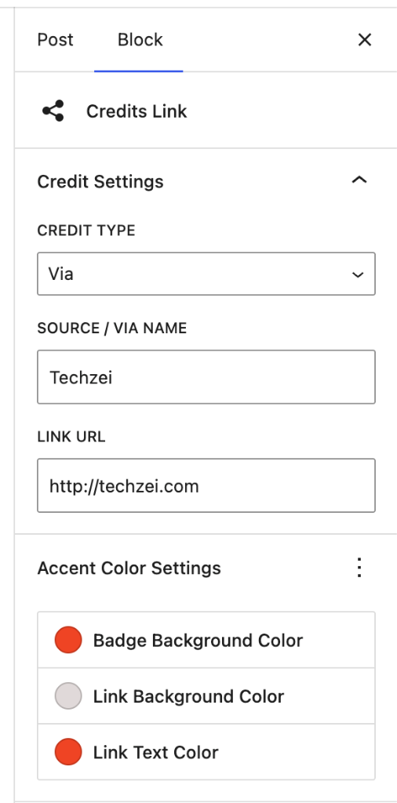

# Credits Shortcode & Block Plugin for WordPress

<p align="center">
  
</p>

[](https://wordpress.org)
[](https://php.net)
[](https://github.com/jashjacob/Credits-Shortcode-Plugin-for-Wordpress)
[](LICENSE)
[](.github/workflows/) <!-- TODO: replace with real CI status badge once the workflow runs on a public CI service -->

**Credits Shortcode & Block** gives readers a clear path back to the original source. Add compact, theme-friendly **Source** or **Via** attribution links to posts and pages without writing markup.

Supports the modern **Gutenberg Block Editor** (with live preview, customizable accent color pickers, and sidebar controls), traditional **Shortcodes**, and legacy **Classic Editor** toolbar buttons.

---

## 📸 Screenshots

| Block Editor Sidebar Controls | Front-End Post Preview |
| :---: | :---: |
|  |  |

---

## 🚀 Features

- 🧩 **Gutenberg Block Editor**: Add credits using a native WordPress block (`/credits`) featuring live in-editor previews and block sidebar controls.
- 🎨 **Custom Accent Colors**: Pick custom badge background, link background, and link text colors directly from the Block Editor sidebar or shortcode parameters.
- ↕️ **Spacing Presets**: Keep consecutive credits compact, standard, or spacious with a site-wide default and per-credit overrides.
- ✨ **Micro-Interaction Hover Effects**: Smooth 0.2s CSS transitions with subtle hover elevation and brightness shifts.
- 📐 **Flush Block Layout Alignment**: Auto-adapts to modern WordPress block themes (Twenty Twenty-Four, Twenty Twenty-Five) to sit 100% flush with paragraph content.
- 🔒 **Security Hardened**: Full WordPress late-escaping architecture (`esc_url()`, `esc_html()`, `esc_attr()`) and color sanitization (`sanitize_hex_color()`).
- ⚡ **Zero Build Dependencies**: Built using standard WordPress JS globals (`wp.blocks`, `wp.element`, `wp.blockEditor`). No `npm build` required.
- 🔄 **100% Backward Compatible**: Legacy shortcodes `[credits]` continue to render seamlessly.

---

## 🛠️ Usage Guide

### Option 1: Gutenberg Block Editor (Recommended)

1. Open any post or page in the WordPress Block Editor.
2. Click **`+`** or type `/credits` to insert the **Credits Link** block.
3. Use the block sidebar (Inspector Controls) to configure:
   - **Credit Type**: Select `Source` or `Via`.
   - **Source / Via Name**: Enter attribution name (e.g., *TechZei*).
   - **Link URL**: Enter source URL (e.g., `https://techzei.com`).
4. Expand **Accent Color Settings** in the block sidebar to customize:
   - **Badge Background Color** (default: `#ef4423`)
   - **Link Background Color** (default: `#E0D9D9`)
   - **Link Text Color** (default: `#ef4423`)
5. Choose a **Spacing** preset—Use site default, Compact, Standard, or Spacious—for this credit.

---

### Option 2: WordPress Shortcodes

Insert shortcodes directly in paragraph blocks, shortcode blocks, or text widgets:

#### **Standard Source Attribution**
```text
[credits link="https://example.com" type="source"]Source Name[/credits]
```

#### **Standard Via Attribution**
```text
[credits link="https://example.com" type="via"]Via Name[/credits]
```

#### **Custom Accent Colors Shortcode**
```text
[credits link="https://example.com" type="source" badge_color="#0073aa" link_color="#f0f0f0" link_text_color="#0073aa"]Source Name[/credits]
```

To control the gap when several credits are stacked, add `spacing="compact"`, `spacing="standard"`, or `spacing="spacious"`. Omit it to use the site-wide default:

```text
[credits link="https://example.com" spacing="compact"]Source Name[/credits]
```

---

### Option 3: Classic Editor (Legacy TinyMCE)

If you use the Classic Editor plugin:
1. Highlight text or click the **Credits Logo** button in the TinyMCE toolbar.
2. Enter the attribution type (`Source` or `Via`), URL, and name when prompted.

---

## 🎨 Customizing Styles via CSS

You can also override the default appearance in **Appearance > Customize > Additional CSS**:

```css
/* Custom background color for Source / Via badge */
.cre_cate {
    background: #0073aa !important;
    font-style: normal;
}

/* Custom background color for link container */
.cre_cate_link {
    background: #f0f0f0 !important;
}

/* Custom link text color on hover */
.cre_cate_link a:hover {
    text-decoration: underline !important;
}
```

---

## 📦 Installation

### From your WordPress admin (recommended)

1. Go to **Plugins > Add New**.
2. Search for "Credits Shortcode & Block".
3. Click **Install Now**, then **Activate**.

### Manual upload

1. Download the plugin as a `.zip` file from [WordPress.org](https://wordpress.org/plugins/) or the [releases page](https://github.com/jashjacob/Credits-Shortcode-Plugin-for-Wordpress/releases).
2. Go to **Plugins > Add New > Upload Plugin** and choose the `.zip`.
3. Activate the plugin through the **Plugins** menu in WordPress.

### For contributors (git)

```bash
git clone https://github.com/jashjacob/Credits-Shortcode-Plugin-for-Wordpress.git
```

Copy or symlink the directory into your site's `/wp-content/plugins/` and activate it. See **Development** below for running the test suite.

---

## 🧪 Development & Testing

The plugin ships with a PHPUnit test suite (34 tests) that runs automatically across PHP 7.4–8.4 in GitHub Actions on every push.

```bash
composer install
vendor/bin/phpunit
```

---

## 🌍 Translations

The plugin is translation-ready via the `credits-shortcode` text domain. If you'd like to contribute a translation, please open a pull request — translators welcome!

---

## 📜 Changelog

### Version 1.6.0
- Requires WordPress 6.3 or newer.
- Registers the Gutenberg block with Block API version 3 consistently.
- Removed the legacy Block API version 1 registration fallback.

### Version 1.5.0
- Added site-wide spacing defaults under **Settings → Credits**.
- Added Compact, Standard, and Spacious spacing presets for each block or shortcode.
- Added spacing inheritance and validation tests.

### Version 1.4.1
- Fixed Gutenberg block registration on WordPress 5.0–5.4.
- Fixed new blocks so they inherit the site-wide default credit type.
- Added block-editor JavaScript translation loading.
- Refreshed the WordPress.org banner, icons, and screenshots.
- Improved release metadata and directory documentation.

### Version 1.4.0
- Added translation support and `block.json` metadata registration.
- Added site-wide defaults under **Settings → Credits**.
- Added a PHPUnit test suite and PHP 7.4–8.4 continuous integration.
- Switched to neutral, theme-friendly default styling while preserving saved colors.

### Version 1.3.1
- Sanitize attributes on input (`esc_url_raw`, `sanitize_text_field`, `sanitize_key`, `sanitize_hex_color`).
- Escape only when building output: `esc_url()` for href, `esc_html()` for text, `esc_attr( safecss_filter_attr() )` for inline CSS.
- Restrict accent colors to hex values and run the final markup through `wp_kses()`.

### Version 1.3
- 🌟 Added native Gutenberg Block support (`credits/shortcode`).
- 🎨 Added custom **Accent Color Pickers** in the Block Editor sidebar and shortcode parameters (`badge_color`, `link_color`, `link_text_color`).
- ✨ Added micro-interaction hover lift animations and smooth CSS transitions.
- 📐 Fixed block layout container specificity for modern WordPress Block Themes (Twenty Twenty-Four, Twenty Twenty-Five).
- 🔒 Hardened shortcode rendering by removing `extract()` and consistently sanitizing and escaping output.
- 📋 Added official WordPress compatibility headers (`Requires PHP: 7.4`, `Tested up to: 6.7`).

### Version 1.2
- Added TinyMCE editor toolbar button integration.
- Initial public release on GitHub & WordPress.org.

---

## 📄 License

Distributed under the GNU General Public License v2 or later. See `LICENSE` for details.

Developed by [Jash Jacob](https://jashjacob.com).
