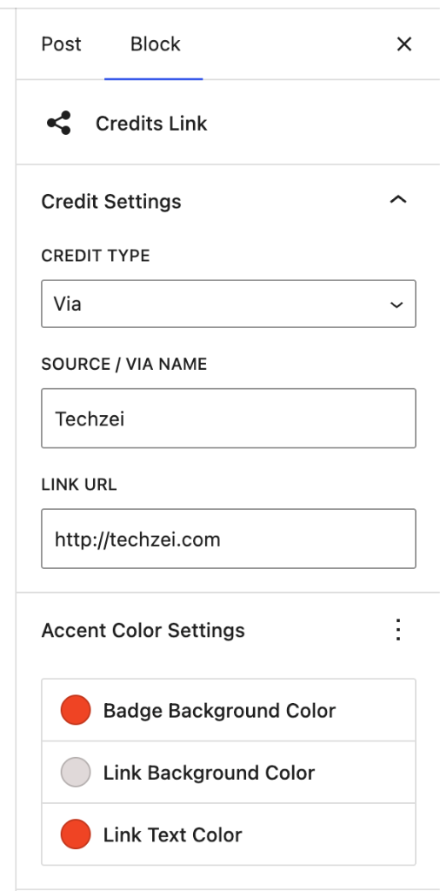

# Credits Shortcode & Block Plugin for WordPress

<p align="center">
  
</p>

[](https://wordpress.org)
[](https://php.net)
[](https://github.com/jashjacob/Credits-Shortcode-Plugin-for-Wordpress)
[](LICENSE)
[](scripts/ci-local.sh)

**Credits Shortcode & Block** gives readers a clear path back to the original source. Add compact, theme-friendly **Source** or **Via** attribution links to posts and pages without writing markup.

Supports the modern **Gutenberg Block Editor** (with live preview, customizable accent color pickers, and sidebar controls), traditional **Shortcodes**, and legacy **Classic Editor** toolbar buttons.

---

## 📸 Screenshots

| Block Editor Sidebar Controls | Front-End Post Preview |
| :---: | :---: |
|  |  |

---

## 🚀 Features

- 🧩 **Gutenberg Block Editor**: Add credits using a native WordPress block (`/credits`). Type the name and link right in the block, with a live preview and sidebar controls. Unfinished credits are flagged in the editor only.
- 🔗 **Link Opening Control**: Credits open in a new tab by default (with `noopener noreferrer`); turn off **Open in new tab** for a same-tab link.
- 🎨 **Custom Accent Colors**: Pick custom badge background, link background, and link text colors directly from the Block Editor sidebar or shortcode parameters.
- ↕️ **Spacing Presets**: Keep consecutive credits compact, standard, or spacious with a site-wide default and per-credit overrides.
- ✨ **Micro-Interaction Hover Effects**: Smooth 0.2s CSS transitions with subtle hover elevation and brightness shifts.
- 📐 **Flush Block Layout Alignment**: Auto-adapts to modern WordPress block themes (Twenty Twenty-Four, Twenty Twenty-Five) to sit 100% flush with paragraph content.
- 🔒 **Security Hardened**: Full WordPress late-escaping architecture (`esc_url()`, `esc_html()`, `esc_attr()`) and color sanitization (`sanitize_hex_color()`).
- ⚡ **Zero Build Dependencies**: Built using standard WordPress JS globals (`wp.blocks`, `wp.element`, `wp.blockEditor`). No `npm build` required.
- 🔄 **100% Backward Compatible**: Legacy shortcodes `[credits]` continue to render seamlessly.

---

## 🛠️ Usage Guide

### Option 1: Gutenberg Block Editor (Recommended)

1. Open any post or page in the WordPress Block Editor.
2. Click **`+`** or type `/credits` to insert the **Credits Link** block.
3. Type the credit name (e.g., *TechZei*) in the block and enter the **Link URL** (e.g., `https://techzei.com`) in the field beneath it. The block is outlined, with a note, until both are filled in (the note appears in the editor only).
4. Use the block sidebar (Inspector Controls) for the rest:
   - **Credit Type**: `Use site default`, `Source`, or `Via`.
   - **Open in new tab**: on by default.
   - **Accent Color Settings**: badge background, link background, and link text colors. Colors you leave unchanged follow **Settings → Credits**; **Reset colors to site default** clears this credit's overrides.
5. Choose a **Spacing** preset—Use site default, Compact, Standard, or Spacious—for this credit.

---

### Option 2: WordPress Shortcodes

Insert shortcodes directly in paragraph blocks, shortcode blocks, or text widgets:

#### **Standard Source Attribution**
```text
[credits link="https://example.com" type="source"]Source Name[/credits]
```

#### **Standard Via Attribution**
```text
[credits link="https://example.com" type="via"]Via Name[/credits]
```

#### **Custom Accent Colors Shortcode**
```text
[credits link="https://example.com" type="source" badge_color="#0073aa" link_color="#f0f0f0" link_text_color="#0073aa"]Source Name[/credits]
```

Credits open in a new tab. Add `newtab="false"` (or `new_tab="false"`) to open in the same tab. WordPress lowercases shortcode attribute names, so `newTab` is for the block only:

```text
[credits link="https://example.com" newtab="false"]Source Name[/credits]
```

To control the gap when several credits are stacked, add `spacing="compact"`, `spacing="standard"`, or `spacing="spacious"`. Omit it to use the site-wide default:

```text
[credits link="https://example.com" spacing="compact"]Source Name[/credits]
```

---

### Option 3: Classic Editor (Legacy TinyMCE)

If you use the Classic Editor plugin:
1. Optionally select the text you want to credit, then click the **Credits Logo** button in the TinyMCE toolbar.
2. Fill in the form: **Credit Type**, **Name** (prefilled from your selection), and **Link URL**, then press **OK** (or **Enter**). A missing name or link, or a link that does not start with `http://`, `https://`, `mailto:` or `ftp://` (relative addresses are fine), keeps the form open with a message.

---

## 🎨 Customizing Styles via CSS

You can also override the default appearance in **Appearance > Customize > Additional CSS**:

```css
/* Scoped selectors match the plugin stylesheet (higher specificity helps on block themes). */
ul.credits .cre_cate {
    background: #0073aa !important;
    font-style: normal;
}

ul.credits .cre_cate_link {
    background: #f0f0f0 !important;
}

ul.credits .cre_cate_link a:hover {
    text-decoration: underline !important;
}
```

---

## 📦 Installation

### From your WordPress admin (recommended)

1. Go to **Plugins > Add New**.
2. Search for "Credits Shortcode & Block".
3. Click **Install Now**, then **Activate**.

### Manual upload

1. Download the plugin as a `.zip` file from [WordPress.org](https://wordpress.org/plugins/) or the [releases page](https://github.com/jashjacob/Credits-Shortcode-Plugin-for-Wordpress/releases).
2. Go to **Plugins > Add New > Upload Plugin** and choose the `.zip`.
3. Activate the plugin through the **Plugins** menu in WordPress.

### For contributors (git)

```bash
git clone https://github.com/jashjacob/Credits-Shortcode-Plugin-for-Wordpress.git
```

Copy or symlink the directory into your site's `/wp-content/plugins/` and activate it. See **Development** below for running the test suite.

---

## 🧪 Development & Testing

### Local CI (runs before every push)

CI runs on your machine, not on GitHub Actions. One command runs the fast tier: PHP lint, the PHPUnit suite, a JavaScript syntax check, the Node tests for the Classic Editor form (`node --test tests/js/*.test.js`, no npm packages), and the WordPress.org release zip check.

```bash
composer install
composer ci          # fast tier, a few seconds
composer setup-hooks # once: run the fast tier automatically on every git push
```

Skip the hook for a single push with `git push --no-verify`.

It tests only the PHP version installed on your machine. The plugin declares **PHP 7.4+**, so avoid syntax or functions newer than that.

To run the PHPUnit suite against a real WordPress, add the integration tier. It installs a disposable WordPress backed by SQLite, so it needs no MySQL or Docker (the first run downloads WordPress and the SQLite plugin):

```bash
composer ci:integration                       # latest WordPress release
WP_VERSION=6.3 composer ci:integration        # any release; 6.3 is the plugin's minimum
```

To also drive the real block editor (insert a credit, edit its name, URL, type, spacing and custom class, save, reload, and check the published page), add the Playwright test. It uses the same SQLite WordPress, so it needs no MySQL either; the first run downloads Playwright and Chromium:

```bash
composer ci:e2e
```

The fast suite (`tests/`) uses WordPress stubs and stays instant. The integration suite (`tests/integration/`) exercises real block registration, script localization, `do_shortcode()`, `do_blocks()`, saving and reloading posts (including roles filtered by kses), settings sanitization, and uninstall. Installs live in `.wordpress-integration/<version>/`; delete that folder to start over.

For the full tier, which adds the WordPress smoke test to everything above, install MySQL (`brew install mysql && brew services start mysql`, root password `root`, or set `WP_DB_HOST` / `WP_DB_USER` / `WP_DB_PASSWORD`):

```bash
composer ci:full
```

### Full WordPress stack (local or Cloud Agent)

Stub PHPUnit does not boot WordPress. For runtime shortcode, block, and variation checks, use the Cloud Agent scripts (also under `.cursor/` in this repo):

```bash
./.cursor/cloud-agent-install.sh   # PHP, Composer, MariaDB, WP-CLI
./.cursor/cloud-agent-start.sh     # WordPress 6.7 + symlinked plugin (admin/admin @ :8080)
./.cursor/cloud-agent-wp-server.sh # optional: wp server on 8080
./.cursor/cloud-agent-verify.sh    # lint, PHPUnit, WP shortcode smoke
./.cursor/cloud-agent-test-variations.sh  # 21 front-end / block scenarios
./.cursor/run-block-editor-e2e.sh  # Playwright block editor (7 checks)
```

The block E2E runner sets site default type to **Via** when `.wordpress/` exists and reads the effective default via `CREDITS_E2E_DEFAULT_TYPE` so tests match **Settings → Credits**.

### Translation template

Regenerate the POT file after changing translatable strings:

```bash
bash scripts/generate-pot.sh
```

Always pass the text domain as a literal (`__( 'Text', 'credits-shortcode' )`), including in the block editor script: the extractor skips strings whose domain is a variable, and a test fails if one slips in. Classic Editor form strings live in `tinymce-i18n.php` because TinyMCE cannot read the block editor's translation data.

---

## 🌍 Translations

The plugin is translation-ready via the `credits-shortcode` text domain. If you'd like to contribute a translation, please open a pull request — translators welcome!

---

## 📜 Changelog

### Unreleased
- Block: edit the credit name and link inline; credits missing a name, a link, or a usable link are flagged in the editor only. Added **Reset colors to site default**.
- Added an **Open in new tab** option to the block (`newTab`) and shortcode (`newtab` / `new_tab`); credits without it still open in a new tab.
- Classic Editor: one form instead of browser prompts, with validation and safer shortcode insertion (a link like `?a=1&copy=2` is no longer corrupted).
- The block's `link` attribute now defaults to an empty string instead of `#`; published output is unchanged.
- Block editor strings are now in the translation template (they were missing), and Classic Editor strings are translated.

### Version 1.6.1
- Fixed the Gutenberg block dropping a custom CSS class added in the editor's Advanced panel from the published output.

### Version 1.6.0
- Requires WordPress 6.3 or newer.
- Registers the Gutenberg block with Block API version 3 consistently.
- Removed the legacy Block API version 1 registration fallback.

### Version 1.5.0
- Added site-wide spacing defaults under **Settings → Credits**.
- Added Compact, Standard, and Spacious spacing presets for each block or shortcode.
- Added spacing inheritance and validation tests.

### Version 1.4.1
- Fixed Gutenberg block registration on WordPress 5.0–5.4.
- Fixed new blocks so they inherit the site-wide default credit type.
- Added block-editor JavaScript translation loading.
- Refreshed the WordPress.org banner, icons, and screenshots.
- Improved release metadata and directory documentation.

### Version 1.4.0
- Added translation support and `block.json` metadata registration.
- Added site-wide defaults under **Settings → Credits**.
- Added a PHPUnit test suite and PHP 7.4–8.4 continuous integration.
- Switched to neutral, theme-friendly default styling while preserving saved colors.

### Version 1.3.1
- Sanitize attributes on input (`esc_url_raw`, `sanitize_text_field`, `sanitize_key`, `sanitize_hex_color`).
- Escape only when building output: `esc_url()` for href, `esc_html()` for text, `esc_attr( safecss_filter_attr() )` for inline CSS.
- Restrict accent colors to hex values and run the final markup through `wp_kses()`.

### Version 1.3
- 🌟 Added native Gutenberg Block support (`credits/shortcode`).
- 🎨 Added custom **Accent Color Pickers** in the Block Editor sidebar and shortcode parameters (`badge_color`, `link_color`, `link_text_color`).
- ✨ Added micro-interaction hover lift animations and smooth CSS transitions.
- 📐 Fixed block layout container specificity for modern WordPress Block Themes (Twenty Twenty-Four, Twenty Twenty-Five).
- 🔒 Hardened shortcode rendering by removing `extract()` and consistently sanitizing and escaping output.
- 📋 Added official WordPress compatibility headers (`Requires PHP: 7.4`, `Tested up to: 6.7`).

### Version 1.2
- Added TinyMCE editor toolbar button integration.
- Initial public release on GitHub & WordPress.org.

---

## 📄 License

Distributed under the GNU General Public License v2 or later. See `LICENSE` for details.

Developed by [Jash Jacob](https://jashjacob.com).
